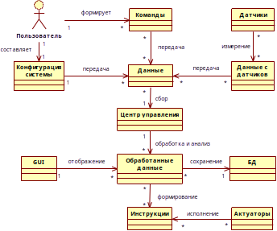
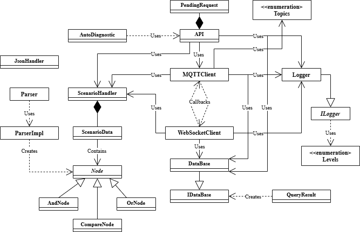
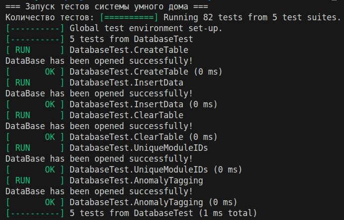
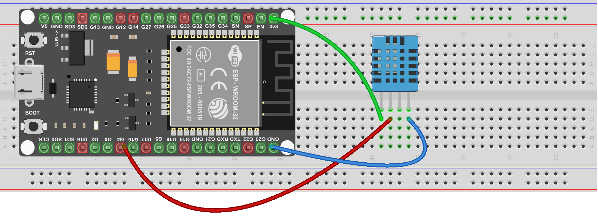
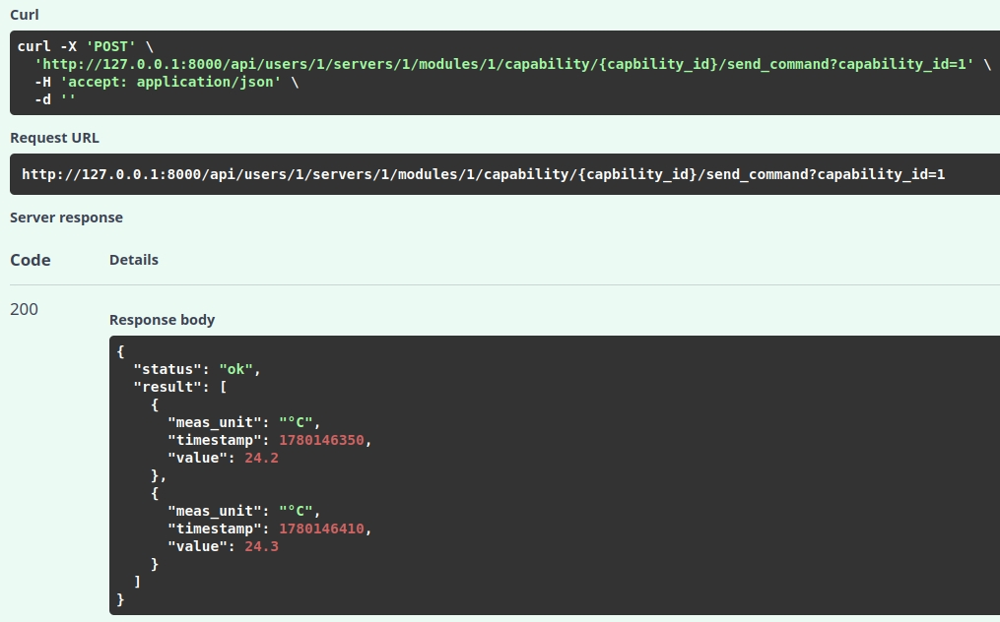
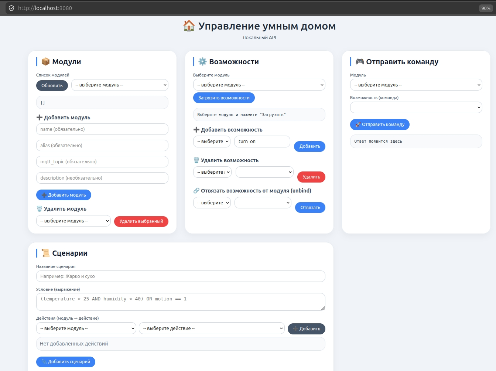

# Модернизация системы управления умным домом


> **Дипломный проект** — модернизированная система управления умным домом с локальной автономностью, самодиагностикой и открытой архитектурой.

---

## Оглавление
- [Предметная область](#предметная-область)
- [Архитектура](#архитектура)
- [Верификация](#верификация)
- [Программно-аппаратные средства разработки](#программно-аппаратные-средства-разработки)
- [Структура проекта](#структура-проекта)
- [Запуск](#запуск)
- [Результаты](#результаты)

---
## Предметная область
### Основные знания ПрО
Объект исследования – процесс модернизации системы управления умным домом.  
Предмет исследования – методы и архитектурные решения для построения отказоустойчивой, расширяемой и приватной системы умного дома.  
Типовой «умный дом» состоит из следующих ключевых компонентов: 
- центр управления; 
- конечные устройства;
- пользовательский интерфейс;
- среда связи.  

---
### Обзор аналогов и проблематика

Система представляет собой **распределённую компонентную архитектуру** с **асинхронным обменом** сообщениями. Она решает ключевые проблемы существующих решений на российском рынке (Яндекс, Сбер, Ростелеком):

| Проблема | Решение |
|----------|---------|
| Закрытость экосистем | Открытые протоколы (MQTT, WebSocket) |
| Зависимость от облака | Локальное управление без интернета |
|Ограниченная гибкость|Построение модульной архитектуры|
| Отсутствие самодиагностики | Обнаружение аномалий через Isolation Forest |
| Высокая стоимость | Доступные компоненты (Raspberry Pi + ESP32) |

---

## Архитектура

Система сочетает два архитектурных стиля:

1. **Клиент-серверный** — для взаимодействия веб-интерфейса с ядром
2. **Событийно-ориентированный** — для обмена сообщениями между ядром и модулями

### Протоколы взаимодействия

| Связь | Протокол |
|-------|----------|
| Веб-интерфейс ↔ Удалённый сервер | REST (HTTP/JSON) |
| Удалённый сервер ↔ Локальный сервер | WebSocket (WSS) |
| Локальный сервер ↔ ESP32 | MQTT |

### Диаграмма классов ПО

На диаграмме классов представлена логическая структура программного обеспечения:

- **API** — REST API для взаимодействия с системой
- **MQTTClient / WebSocketClient** — связь с устройствами и удалённым сервером
- **DataBase / IDataBase / QueryResult** — работа с SQLite
- **ScenarioHandler** — обработка сценариев (AST)
- **Parser / ParserImpl / Node** — парсинг логических выражений
- **JSONHandler** — работа с конфигурационными файлами
- **Logger / ILogger** — централизованное логирование


## Верификация
### Модульное тестирование
Классы для работы с БД, сценариями и конфигурационными файлами были покрыты автоматическими модульными тестами при помощи фреймворка GoogleTest. Всего было написано более 80 тестов, которые успешно проходят.


### Модуль климат-контроля
Для ручного интеграционного тестирования был собран модуль климат контроля.


### Удаленное управление
Пользователь может изменять конфигурацию системы, выполнять команды и формировать сценарии автоматизации.


### Локальное управление
При работе системы могут возникнуть различные чрезвычайные ситуации. Одной из таких является выход из строя удаленного сервера. Данная ситуация была предусмотрена.  
При выходе удаленного сервера из строя весь функционал в полном объеме продолжает работать в штатном режиме. Единственное, пропадает возможность удаленного управления.


## Программно-аппаратные средства разработки
### Аппаратное обеспечение
|Компонент|Модель|
|---------|------|
|Локальный сервер|Raspberry Pi 4 Model B (4 ГБ)|
|Микроконтроллер|ESP32-WROOM-32|
|Датчик|DHT11|
### Программное обеспечение
|Компонент|Технология|
|---------|----------|
|Ядро системы|C++17 (Crow, Mosquitto, websocketpp)|
|Веб-интерфейс (удалённый)|Python (FastAPI)|
|Веб-интерфейс (локальный)|HTML + JavaScript|
|База данных|SQLite|
|Самодиагностика|Python (scikit-learn, Isolation Forest)|
|Тестирование|Google Test|
|Сборка|CMake|


## Структура проекта
```
SIMPLE_LOGGER/              # подмодуль

auto-diagnostics/           # самодиагностика
├── .env.example
├── auto_diagnostic.py
└── requirements.txt

cloud-server                # удаленный сервер
├── .env.example
├── database_worker.py
├── requirements.txt
└── ws_serv.py

cpp-server/                 # локальный сервер      
├── src/
│   ├── configs/          
│   ├── include/           
│   ├── src/               
│   ├── web/                        
├── CMakeLists.txt             
└── main.cpp

firmware/                   # прошивка модуля климат-контроля
├── include
├── lib
├── src
├── test
├── .gitignore
└── platformio.ini

tests/                      # авто тесты
├── unit/
├── CMakeLists.txt
└── main.cpp

```
## Запуск 
### Удаленный сервер
```bash 
cd cloud-server
python -m venv myenv
source myenv/bin/activate
pip install -r requirements.txt
python main.py
```

### Локальный сервер
```bash
# установка зависимостей
sudo apt update && 
sudo apt install build-essential cmake
libsqlite3-dev libmosquitto-dev 
libboost-all-dev

# сборка
cd cpp-server
mkdir build && cd build
cmake ..
cmake --build . -j

# запуск
./SmartHomeSystem
```

### Прошивка
Необходимо установить расширение в vs code - platformIO.
```bash
cd esp32-firmware
pio run --target upload
```

## Результаты
Модернизированная система управления умным домом позволяет: 
- формировать конфигурацию системы;
- получать и визуализировать данные в реальном времени;
- добавлять множество различных модулей с любой функциональностью;
- формировать сложные сценарии; 
- обнаруживать неисправность модуля до момента его выхода из строя;
- хранить данные локально для обеспечения приватности.  

Область применения:
- типовые жилые помещения (квартира, дом);
- помещения с нестабильным или отсутствующим интернетом (дачные участки и др.);
- объекты с повышенными требованиями к информационной безопасности и автономности (военные части, режимные предприятия, банковские хранилища и др.).
